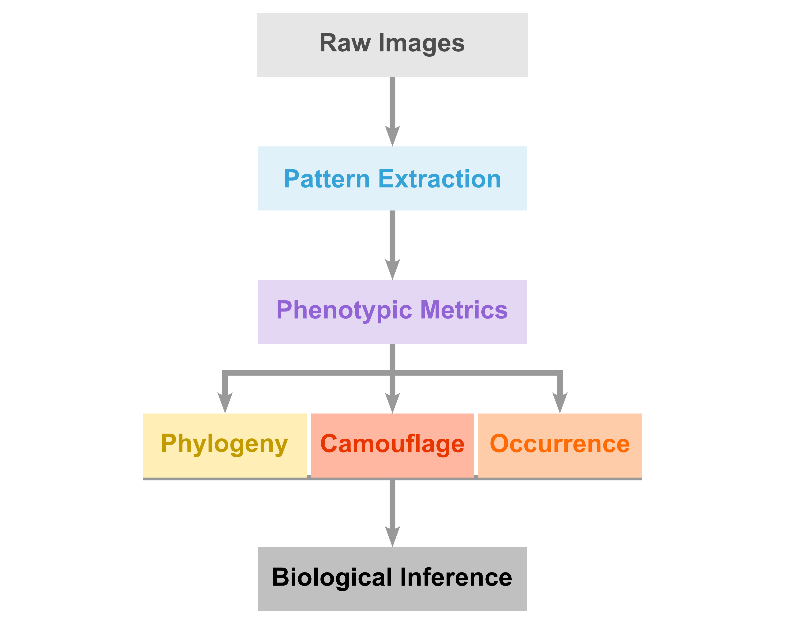
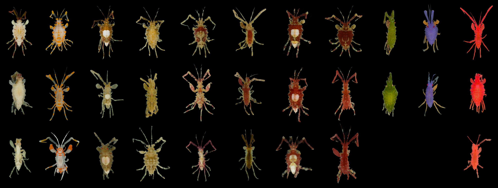
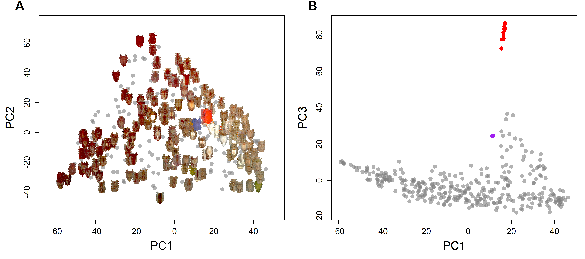
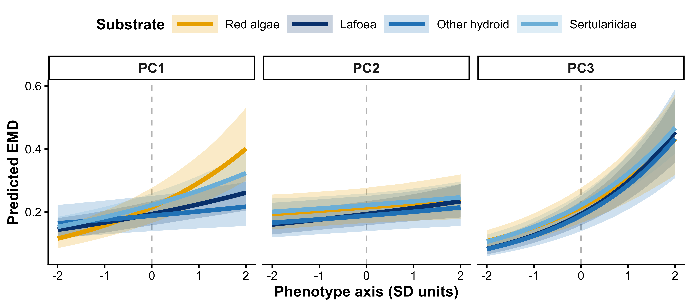
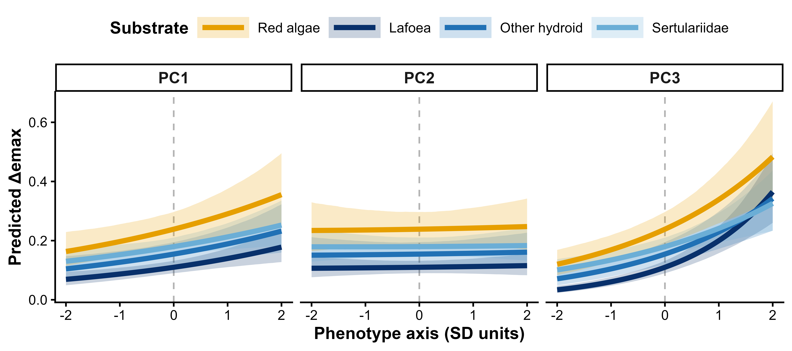
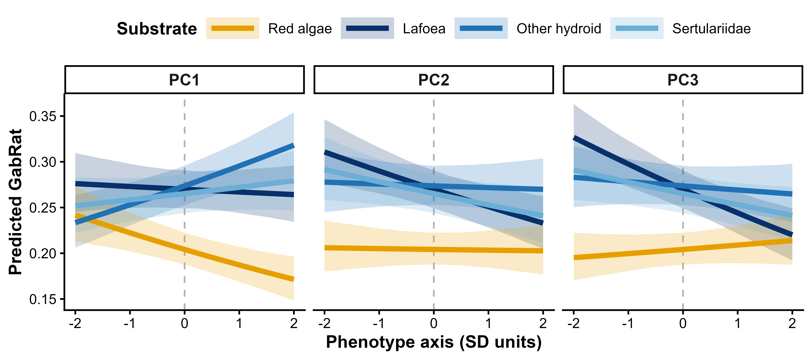
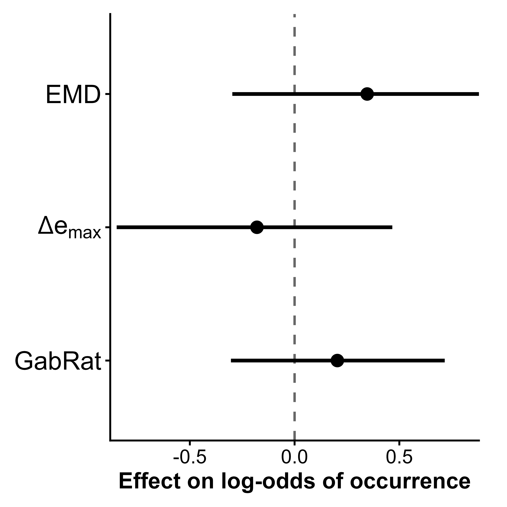
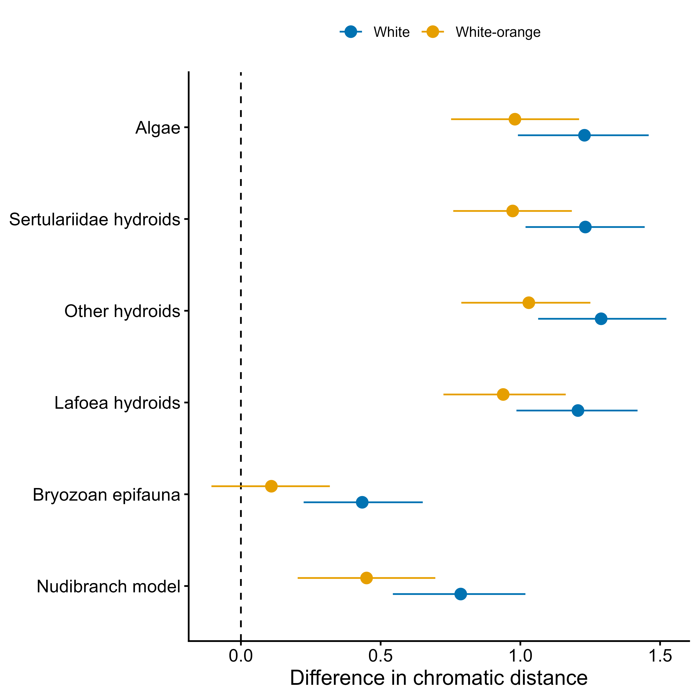

# Podocerus Phenotypic Diversity Analysis

## Overview

This repository contains the analytical workflow used to investigate phenotypic diversity in the marine amphipod *Podocerus aff. cristatus*.

The project integrates image-derived phenotypes, phylogenetic analyses, hierarchical Bayesian modeling, camouflage assessment, and ecological data to examine how color-pattern variation is distributed within a species and whether phenotypic diversity is best characterized as discrete morphs or continuous multivariate variation.

Analyses further evaluate relationships among phenotype, microhabitat use, camouflage performance, nudibranch resemblance, and genetic structure.

<p align="center">
  
</p>

---

## Workflow Summary

### 1. Image Processing & Phenotype Extraction

`01_pattern_extraction.Rmd`

* Image standardization and preprocessing
* Color calibration workflows
* Pattern extraction and quantification
* Principal component analysis of phenotypic variation
* Preparation of image-derived phenotypic datasets

### 2. Phylogenetic Analyses

`02_phylogenetic_structure.Rmd`

* Sequence alignment and quality control
* Haplotype analyses
* Phylogenetic reconstruction
* Species delimitation analyses
* Evaluation of genetic structure across phenotypes

### 3. Chromatic Camouflage Assessment

`03_chromatic_background_matching.Rmd`

* Chromatic contrast analyses
* Background matching assessments
* Quantification of color similarity between amphipods and substrates

### 4. Achromatic Camouflage Assessment

`04_achromatic_background_matching.Rmd`

* Achromatic contrast analyses
* Luminance-based camouflage metrics
* Quantification of brightness matching between amphipods and substrates

### 5. Outline Disruption Analysis

`05_outline_disruption.Rmd`

* Outline disruption analyses
* GabRat edge-disruption metrics
* Evaluation of disruptive coloration as a camouflage mechanism

### 6. Bayesian Ecological Models

`06_occurrence_models.Rmd`

* Hierarchical Bayesian generalized linear mixed models
* Microhabitat association analyses
* Population occurrence models
* Phenotype–environment relationships
* Site-level random effects
* Posterior inference and model comparison

### 7. Nudibranch Similarity Analyses

`07_nudibranch_similarity.Rmd`

* Phenotypic comparisons between amphipods and nudibranchs
* Evaluation of nudibranch resemblance hypotheses
* Ecological predictors of conspicuous phenotypes

---

## Analytical Approaches

* Principal Components Analysis (PCA)
* Hierarchical Bayesian generalized linear mixed models
* Bayesian model selection and comparison
* Posterior predictive inference
* Multivariate statistical analyses
* Permutation-based hypothesis testing
* Color-pattern clustering
* Phylogenetic inference
* Haplotype network analyses

---

## Software & Packages

Primary analyses were conducted using:

* R
* R Markdown
* tidyverse
* brms
* colordistance
* vegan
* cluster
* ape
* pegas
* ggtree
* ImageJ
* Geneious
* IQ-TREE

---

## Research Applications

This workflow demonstrates approaches for:

* Quantitative phenotype analysis
* Hierarchical Bayesian modeling
* Integration of imaging, ecological, and genetic datasets
* Multivariate biological data analysis
* Camouflage and visual ecology research
* Reproducible scientific workflows

---

## Repository Structure

```text
├── README.md
├── LICENSE
│
├── figures/
│   ├── Workflow_Diagram.png
│   ├── pod_examples.png
│   ├── substrate_examples.png
│   ├── phenotype_pca.png
│   ├── 03_plot.png
│   ├── 04_plot.png
│   ├── 05_plot.png
│   ├── 06_plot.png
│   └── 07_plot.png
│
└── analysis/
    ├── 01_pattern_extraction.Rmd
    ├── 02_phylogenetic_structure.Rmd
    ├── 03_chromatic_background_matching.Rmd
    ├── 04_achromatic_background_matching.Rmd
    ├── 05_outline_disruption.Rmd
    ├── 06_occurrence_models.Rmd
    └── 07_nudibranch_similarity.Rmd
```

---

## Example Inputs

<p align="center">
  
  
</p>

---

## Example Outputs

<p align="center">
  
  
  
  
</p>

<p align="center">
  
  
</p>

---

## Example Inputs
<p align="center">
  
  
</p>

---

## Example Outputs
<p align="center">
  
  
  
  
</p>
<p align="center">
  
  
</p>

---

## Associated Research

Cummings, B.C. *Unraveling Amphipod Diversity Across Phylogenetic, Phenotypic, and Community Scales*. PhD Dissertation, University of Florida (2026).

Cummings, B.C. *Continuous Phenotypic Diversity in Podocerus aff. cristatus*. Manuscript in preparation.

Goddard JHR. 2016. Latitudinal variation in mimicry between aeolid nudibranchs and an amphipod crustacean in the northeast Pacific Ocean. Marine Biodiversity. 46(3):535–537.

---

## Author

**Brittany Cummings, PhD**

Evolutionary Genomics Researcher
